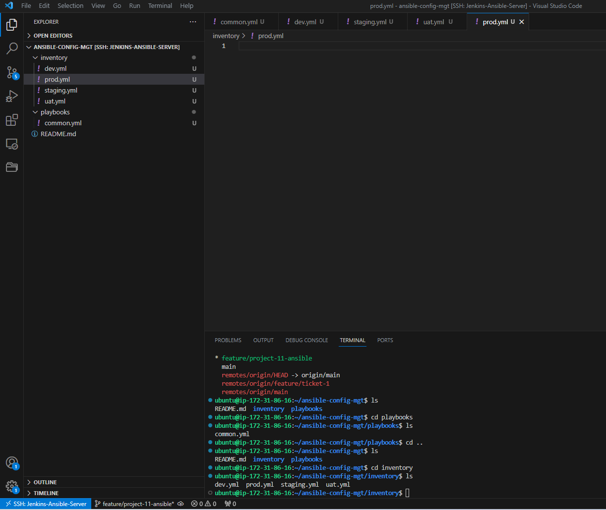

## **Documentation for Project 11**

### Installing Ansible
`sudo apt update`

`sudo apt install ansible`

### Configuring Jenkins Build Job to save repository content anytime an Update is made

### Creating a Freestyle Project Ansible

### Configuring Webhook to Trigger Ansible Build Automatically

### Configuring a Postbuild Job to Archive Artifacts

### Testing setup by Updating README File

### First Successful Build for Ansible

### Artifacts Saved Locally on Jenkins Server

### Cloning Down ansible-config-mgt on ansible instance
`git clone https://github.com/Banky4real/ansible-config-mgt.git`

### Creating a new git Branch that will be used for the development of a new feature

### Checking out the newly created feature branch to our local machine to start building code and directory structure

### Setting up ssh host config

### Successful Connection to remote host Jenkins ansible server

### Checking out or switching to our newly created feature branch on our local machine

`git checkout -b feature/project-11-ansible`

### Creating files and folders for the development of our new features

### Setting up our Ansible inventory in order to be able to ssh into remote host to execute tasks

### Importing our control server private key into ssh agent

#### Initializing SSH agent
`eval `ssh-agent -s` `

#### Path to our control server (Jenkins Ansible Server) Private Key
`ssh-add /home/ubuntu/.ssh/id_rsa`

### Confirming our control server private key has been added to ssh agent

`ssh-add -l`

### SSH into webserver 1

`ssh -A ec2-user@3.86.167.125`

### Updating our Inventory/dev.yml with the Private Ip's of the target servers

` [nfs] `
` 172.31.93.135 ansible_ssh_user='ec2-user' `

` [webservers] `
` 172.31.88.170 ansible_ssh_user='ec2-user' ` 
` 172.31.94.194 ansible_ssh_user='ec2-user' `

` [db] `
` 172.31.92.231 ansible_ssh_user='ubuntu' `

` [lb] `
` 172.31.92.204 ansible_ssh_user='ubuntu' `

### Testing Connectivity to one of our target servers in the inventory dev.yml file by Pinging Load Balancer(lb), returned success

`ansible lb -m ping -i dev.yml`

### Testing Connectivity to all of our target servers in the inventory dev.yml file by Pinging all, returned success

`ansible all -m ping -i dev.yml`

