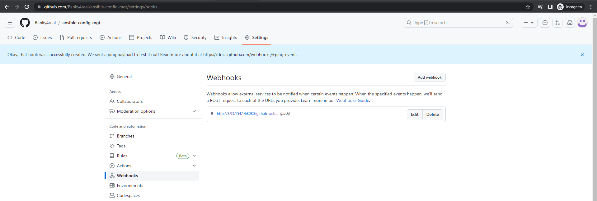

## **Documentation for Project 11**

### Installing Ansible
`sudo apt update`

`sudo apt install ansible`

### Configuring Jenkins Build Job to save repository content anytime an Update is made

### Creating a Freestyle Project Ansible

### Configuring Webhook to Trigger Ansible Build Automatically

### Configuring a Postbuild Job to Archive Artifacts

### Testing setup by Updating README File

### First Successful Build for Ansible

### Artifacts Saved Locally on Jenkins Server

